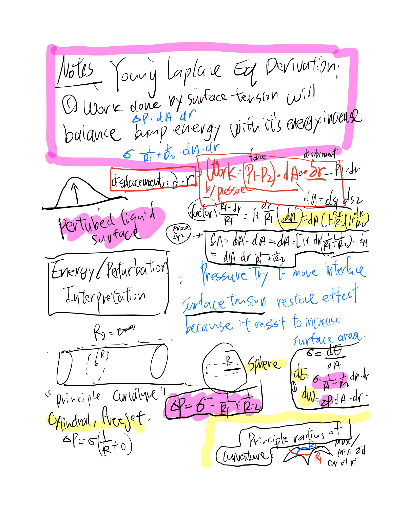
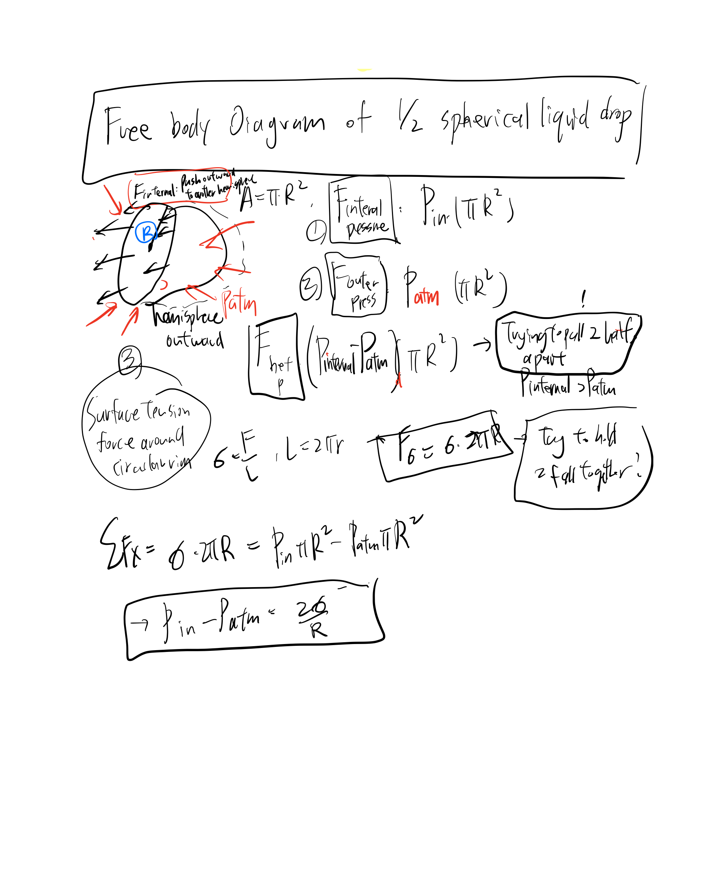

# ME106 Fluid Mechanics

## 1. Governing Equations 
- Navier Stokes equation
- Scalar velocity 
- Steam Function
- Flow geometry (Laplace)
- Reynolds number 
- log-polar coordinates

## 2.Steady Flows
- Finite difference method
- Successive Over relaxation equation fro 2D steady state flow govern by Laplace's equation
- Boundary Condition 
- Project: Steady flow solution for Re=10

## 3.UnSteady Flows
- Periodic Boundary Condition 
- Matrix algebra techniques
- Runge-Kutta Methods 
- Project: UnSteady flow solution for Re=60

## Concepts from Fundamentals of Fluid Mechanics (8th Ed. - Munson)

### HW1: Density,**Specific Volume, Specific Weight, Specific Gravity, Ideal Gas Law, Viscosity, Compressibility of Fluids, Bulk Modulus, Compression and Expansion of Gases, Vapor Pressure, Surface Tension
## Surface Tension: Liquis maintains a shape @ fluid fluid interface due to cohesive forces 

#### Viscosity Profile and Shear Stress

* **Newton's Law of Viscosity (1D flow):**
$$\tau = \mu \frac{du}{dy}$$

---

#### Surface Tension & Capillary Action

* **Young-Laplace Law (Pressure difference and curvature):**
$$\Delta P = P_{\text{inside}} - P_{\text{outside}} = \sigma \left( \frac{1}{R_1} + \frac{1}{R_2} \right)$$

* **Spherical Droplet ($R_1 = R_2 = R$):**
$$\Delta P = \frac{2\sigma}{R}$$

* **Spherical Soap Bubble (Two interfaces):**
$$\Delta P = \frac{4\sigma}{R}$$

* **Cylindrical Jet ($R_1 = R, R_2 = \infty$):**
$$\Delta P = \frac{\sigma}{R}$$

* **Capillary Effect (Height of fluid column in a tube of radius $r$):**
$$h = \frac{2\sigma \cos\theta}{\rho g r}$$

* **Water Strider Support Force Balance:**
$$F_{\text{ST}} = N \cdot L_{\text{leg}} \cdot \sigma \cos\theta$$

---

#### Free Body Diagrams, Free Jets & Concentric Cylinder Viscometer

* **Control Volume Force Balance for a Free Jet Deflected by Angle $\theta$:**
$$F_x = \dot{m}(v_{\text{in}} - v_{\text{out},x}) = \rho A v^2 (1 - \cos\theta)$$

* **Perpendicular Impact on a Flat Surface or Cylinder ($\theta = 90^\circ$ deflection):**
$$F_x = \rho A v^2$$

* **Concentric Cylinder Viscometer — Side Shear Stress (Narrow gap $\Delta r = R_o - R_i$):**
$$\tau_{\text{side}} = \mu \frac{\Omega R_i}{\Delta r}$$

* **Concentric Cylinder Viscometer — Side Torque ($T_{\text{side}}$ on inner cylinder of radius $R_i$ and height $H$):**
$$T_{\text{side}} = \tau_{\text{side}} \cdot (2\pi R_i H) \cdot R_i = \frac{2\pi \mu \Omega R_i^3 H}{\Delta r}$$

* **Concentric Cylinder Viscometer — Bottom Surface Shear Stress at radius $r$ (Bottom gap $h_b$):**
$$\tau_{\text{bottom}}(r) = \mu \frac{\Omega r}{h_b}$$

* **Concentric Cylinder Viscometer — Bottom Torque ($T_{\text{bottom}}$ integrated across bottom disk of radius $R_i$):**
$$T_{\text{bottom}} = \int_{0}^{R_i} r \cdot \left(\mu \frac{\Omega r}{h_b}\right) (2\pi r \, dr) = \frac{\pi \mu \Omega R_i^4}{2 h_b}$$

* **Total Viscous Torque ($T_{\text{total}}$):**
$$T_{\text{total}} = T_{\text{side}} + T_{\text{bottom}} = 2\pi \mu \Omega R_i^3 \left( \frac{H}{\Delta r} + \frac{R_i}{4 h_b} \right)$$
---

### HW2: 

## Discussion- Different Approaches for Questions  
- Torque of Concentric-cylinder viscometer Inner cylinder (To know the torque transmitted through liquid to the inner cylinder) : Rotation -> Velocity Difference -> **Shear Stress / divide by area**-> **Shear Force** ->  Torque
